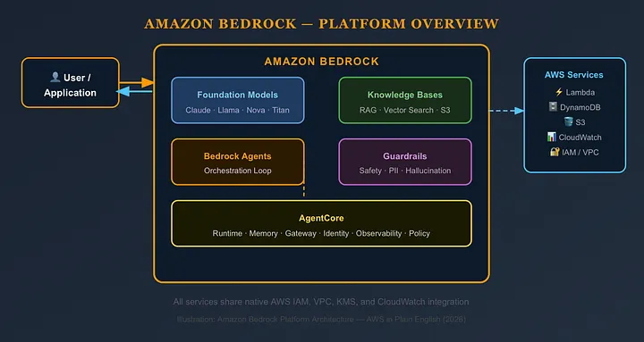
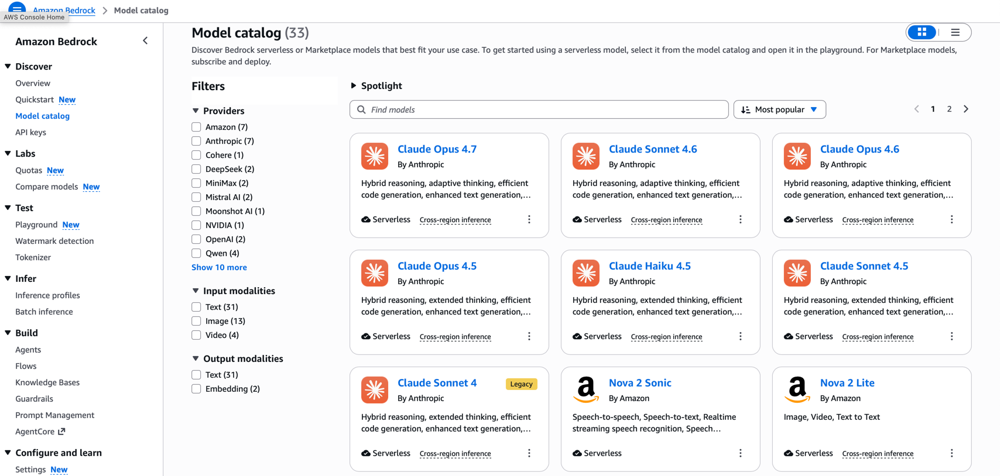
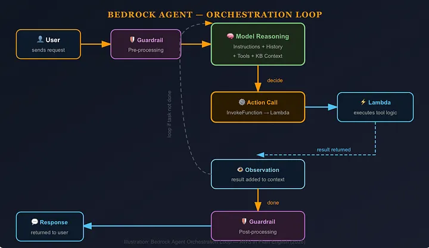

# Overview

We can describe what we want to accomplish in natural language, and agents generate the plan. They write the code, call the necessary tools, and execute the complete solution.

| BUILDING BLOCK    | WHAT IT DOES                                                                     | ANALOGY            |
|-------------------|----------------------------------------------------------------------------------|--------------------|
| Foundation Models | Pre-trained LLMs you invoke via API                                              | The brain          |
| Knowledge Bases   | Managed RAG - connect S3 docs, auto-embed, auto-retrieve                         | The memory         |
| Agents            | Orchestrated action loops - define tools, let the model decide when to call them | The hands          |
| Guardrails        | Content filters + PIl detection enforced at the infrastructure level             | The conscience     |
| AgentCore         | Production-grade infra for deploying and operating agents at scale               | The factory floor  |

# Why use Amazon Bedrock?

- **Simplified Management**: Bedrock offers a fully managed service, which means users don’t need to worry about the 
underlying infrastructure, such as server provisioning, patching, and maintenance.
- **Faster Time to Market**: By simplifying the deployment process, Bedrock helps bring AI-driven products and services 
to market more quickly. This speed provides a competitive advantage, especially in industries where staying ahead of technological trends is essential.
- **Scalability**: As part of the AWS ecosystem, Bedrock seamlessly scales to meet demand. Whether handling large volumes 
of data or increased user requests, Bedrock automatically adjusts computational resources to keep applications running smoothly.
- **Security and Compliance**: Leveraging AWS’s robust security framework, Bedrock ensures that data remains secure and 
complies with relevant regulations, which is crucial for businesses handling sensitive or personal data.
- **Integration with AWS Services**: Bedrock integrates well with other AWS services, creating a cohesive environment 
that enhances productivity. It works smoothly with tools like Amazon SageMaker for model training, AWS Lambda for 
serverless compute, and more, fostering synergies across different AWS tools.
- **Cost Efficiency**: Maintaining AI infrastructure can be costly. Bedrock’s pay-as-you-go model minimizes upfront 
investments and aligns costs with usage, making advanced AI accessible to businesses of all sizes. However, frequent 
or heavy usage may increase costs over time, so monitoring usage is essential to stay within budget.

# The Four Core Components of a Bedrock Agent

Building a Bedrock Agent requires understanding four things that you configure at build-time:

#### FOUNDATION MODEL

You choose which model is the 'brain' of your agent. Claude 3.5 Sonnet (for complex reasoning), Amazon Nova Pro (for cost-efficiency), and Llama 3 (for open-weight flexibility)
The model interprets user input, decides which tool to call, and generates the final response.

#### INSTRUCTIONS

You write a natural language description of what the agent is supposed to do its persona, its scope, its constraints.
For example: "You are a smart city management agent. Your job is to check information availability and return it to the user. Never modify the data." These instructions become part of every prompt the agent receives.

#### ACTION GROUPS

Action groups are the tools your agent can use. Each action group contains one or more API operations defined via an OpenAPI schema. When the agent decides it needs to call a tool, it invokes the corresponding Lambda function. This is where agents go from "talking about doing things" to actually doing them.

#### KNOWLEDGE BASES (OPTIONAL)

If your agent needs to answer questions grounded in private data internal documentation, product catalogs, support tickets — you attach a Knowledge Base. Bedrock handles the embedding, vector storage, and retrieval automatically. When the agent determines it needs this information, it queries the knowledge base as part of its orchestration loop.

